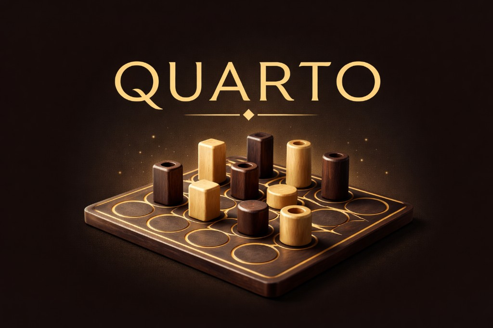

<p align="center">
  
</p>

<h1 align="center">Quarto</h1>

<p align="center"><strong>A production-ready 3D browser implementation of the classic abstract strategy game.</strong></p>

<p align="center">
  React · TypeScript · React Three Fiber · Tailwind · Zustand · i18next · FastAPI · WebSockets
</p>

---

## About

**Quarto** is played on a **4×4** board with **16 unique pieces**. Each piece has four binary traits (light/dark, tall/short, round/square, hollow/solid). Players do not choose their own piece to place: on each turn you **pick a free piece for your opponent**, they **place it** on an empty cell, then they **choose your next piece**. You win when any **row, column, or diagonal** contains four pieces that share **at least one** trait in common. A full board with no winning line is a **draw**.

This project delivers a **polished tabletop-style 3D scene**, **local two-player**, **heuristic bot**, **online rooms** with shareable links and server-validated moves, **eight UI languages**, move history, rules modal, sound toggle, and preferences persisted in the browser.

---

## Features

| Area | Details |
|------|---------|
| **3D** | Wood-toned pieces, soft lighting, legal-cell highlights, winning line emphasis, camera reset |
| **Modes** | Local pass-and-play, vs bot (easy / medium / hard), online via room code + invite URL |
| **i18n** | English, Ukrainian, Russian, Polish, Chinese, Spanish, German, French — JSON locales, no hardcoded UI strings |
| **Backend** | FastAPI: create/join room, GET state, WebSocket sync, invalid-move rejection |
| **Deploy** | Vite production build; optional reverse proxy for `/api` and `/ws` |

---

## Repository layout

```
quarto/
├── frontend/          # Vite + React + R3F app
│   ├── public/        # Static assets (e.g. hero-quarto.png for the main menu)
│   └── src/           # Components, logic/, store/, i18n/, network/
├── backend/           # FastAPI + in-memory rooms (extensible to PostgreSQL)
└── README.md
```

---

## Prerequisites

- **Node.js** 20+ (or 18+)
- **Python 3.11, 3.12, or 3.13** — Python 3.14 may fail to install **Pydantic** wheels; prefer `python3.12 -m venv .venv` in `backend/`.

---

## Quick start

### Backend

```bash
cd backend
python3.12 -m venv .venv
source .venv/bin/activate          # Windows: .venv\Scripts\activate
pip install -r requirements.txt
uvicorn main:app --reload --host 0.0.0.0 --port 8000
```

Health: `http://127.0.0.1:8000/health`

### Frontend

```bash
cd frontend
npm install
npm run dev
```

Open **http://127.0.0.1:5173** — the dev server proxies `/api` and `/ws` to the backend (`vite.config.ts`).

### Production build (frontend)

```bash
cd frontend
npm run build
npm run preview
```

---

## Push to GitHub

**Repository:** [github.com/mulieris/Quarto-Game](https://github.com/mulieris/Quarto-Game)

From the project root (use **Terminal.app** if your IDE blocks `.git/hooks`):

```bash
cd /Users/kasperka/quarto
chmod +x scripts/push-to-github.sh && ./scripts/push-to-github.sh
```

Use an **HTTPS** remote (`https://github.com/mulieris/Quarto-Game.git`) unless SSH keys are set up for GitHub. For day-to-day updates: `git add .`, `git commit -m "…"`, `git push`.

The **hero image** is at `frontend/public/hero-quarto.png` (main menu + README banner).

---

## Architecture (short)

1. **Rendering** — R3F scene, board, pieces, tray layout.  
2. **Game logic** — Pure TypeScript engine, validation, win detection.  
3. **State** — Zustand store for modes, phases, bot/online coordination.  
4. **Network** — REST + WebSocket client; server is source of truth for online moves.  
5. **i18n** — `i18next` + per-locale JSON under `frontend/src/i18n/locales/`.  
6. **Backend** — Room manager, game sync, WebSocket broadcaster.

---

## Roadmap (ideas)

Ranked play, accounts, clocks, spectators, chat, stronger AI (minimax / MCTS), PostgreSQL rooms, mobile-first layout pass.

---

## License

Add a `LICENSE` file in the repository root if you plan to open-source the project (e.g. MIT).
